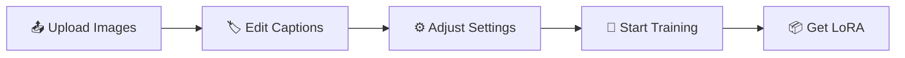

<div align="center">

# 🎨 EasyLora


**Train Your Custom LoRA Models with One Click**

[](https://python.org)
[](https://fastapi.tiangolo.com)
[](https://reactjs.org)
[](https://typescriptlang.org)
[](https://tailwindcss.com)

English | [简体中文](./README.md)


</div>

---

## ✨ Features

<table>
<tr>
<td width="50%">

### 🚀 Ready to Use
- Zero configuration needed
- Auto GPU / VRAM detection
- Smart parameter recommendations

</td>
<td width="50%">

### 🎯 User-Focused
- Drag & drop image upload
- Visual caption editing
- Real-time training progress

</td>
</tr>
<tr>
<td width="50%">

### 🔧 Flexible & Powerful
- SD1.5 / SD2.1 / SDXL support
- Multiple optimizers
- Resume from checkpoint

</td>
<td width="50%">

### 📦 One-Click Deploy
- Auto-copy to WebUI on completion
- Checkpoint saving
- Complete logging

</td>
</tr>
</table>

---

## 🛠️ Tech Stack

<div align="center">

| Layer | Technologies |
|:---:|:---|
| **Frontend** | React 18 + TypeScript + Vite + Tailwind CSS |
| **Backend** | FastAPI + WebSocket + Pydantic |
| **Training** | Kohya sd-scripts + PyTorch + CUDA |
| **Tools** | bitsandbytes + accelerate + safetensors |

</div>

---

## 📁 Project Structure

```
EasyLora/
├── 🐍 server.py              # FastAPI backend server
├── 📁 EasyLora/              # Training core module
│   ├── train.py              # Training logic
│   └── config.py             # Configuration management
├── 🌐 web/                   # React frontend
│   └── src/
│       ├── ui/               # UI components
│       ├── store.ts          # State management
│       └── utils/            # Utility functions
├── 📂 workspace/             # Data workspace
│   ├── raw_uploads/          # Raw uploads
│   └── processed/dataset/    # Processed data
├── 📦 outputs/               # Training outputs
└── ⚙️ user_settings.json     # User settings
```

---

## 🚀 Quick Start

### Requirements

| Dependency | Version | Notes |
|:---:|:---:|:---|
| Python | 3.10+ | Virtual environment recommended |
| Node.js | 18+ | Frontend build |
| CUDA | 11.8+ | GPU acceleration (optional) |
| VRAM | 6GB+ | 8GB+ recommended |

### 1️⃣ Start Backend

```bash
# Create virtual environment
python -m venv .venv

# Activate (Windows)
.\.venv\Scripts\activate

# Activate (Linux/Mac)
source .venv/bin/activate

# Install dependencies
pip install -r requirements.txt

# Start server
python server.py
```

> 🌐 Backend URL: `http://127.0.0.1:8000`

### 2️⃣ Start Frontend

```bash
cd web
npm ci
npm run dev
```

> 🌐 Frontend URL: `http://127.0.0.1:5173`

---

## 📖 Workflow

<div align="center">



</div>

### Step 1: Upload Images 📤

- Drag and drop images to the upload area
- Batch upload supported
- Auto preview & thumbnails

### Step 2: Edit Captions 🏷️

- Click an image to open editor
- Use preset tags for quick addition
- Custom tags supported

### Step 3: Adjust Settings ⚙️

| Parameter | Recommended | Description |
|:---|:---:|:---|
| Learning Rate | 5 (medium) | 1-10 scale, auto-mapped |
| Training Steps | 1200 | Adjust based on image count |
| Optimizer | AdamW8bit | Recommended for low VRAM |
| Save Interval | 200 | 0 = save final only |

### Step 4: Start Training 🚀

- Click "Start Training" button
- View real-time logs and progress
- Stop anytime if needed

---

## 🎓 Advanced Tips

### 🔬 Auto-detect Optimal Learning Rate with DAdaptation

<details>
<summary><b>Click to expand detailed steps</b></summary>

#### Phase 1: Detection

1. Select **`DAdaptation (Auto LR)`** optimizer
2. System auto-sets UNet LR = 1.0, TextEnc LR = 0.5
3. Start training, observe D value in logs
4. When value stabilizes, record it and stop training

#### Phase 2: Formal Training

1. Divide the recorded value by **3**
2. Switch optimizer to **`Lion`** or **`AdamW8bit`**
3. Enter the calculated learning rate
4. Start formal training

</details>

### ⚡ VRAM Optimization Guide

| VRAM | Recommended Config |
|:---:|:---|
| 6GB | Optimizer: AdamW8bit, Batch: 1 |
| 8GB | Optimizer: AdamW8bit, Batch: 2 |
| 12GB+ | Optimizer: Lion, Batch: 4 |

---

## 🔌 API Reference

<details>
<summary><b>Main Endpoints</b></summary>

| Method | Endpoint | Description |
|:---:|:---|:---|
| `GET` | `/api/settings` | Get configuration |
| `POST` | `/api/settings` | Save configuration |
| `POST` | `/api/upload` | Upload images |
| `POST` | `/api/update-caption` | Update caption |
| `GET` | `/api/processed-images` | List processed images |
| `POST` | `/api/stop` | Stop training |
| `WS` | `/ws/train` | Training progress stream |

</details>

---

## ⚙️ Configuration

<details>
<summary><b>Common Settings</b></summary>

```json
{
  "DEFAULT_OUTPUT_DIR": "./outputs",
  "DEFAULT_WORKSPACE_DIR": "./workspace",
  "DEFAULT_SD_WEBUI_LORA_DIR": "C:/path/to/webui/models/Lora",
  "COPY_TO_SD_WEBUI_ON_FINISH": true,
  "LR_SLIDER_MIN": 1e-5,
  "LR_SLIDER_MAX": 1e-4,
  "AUTO_ADD_MODEL_NAME_PREFIX": true
}
```

</details>

---

## 🧪 Testing

```bash
# E2E tests
cd web
npx playwright install
npm run test:e2e
```

---

## 📝 FAQ

<details>
<summary><b>Q: First startup is slow?</b></summary>

A: Model weights need to be downloaded, and data is preprocessed to `workspace/processed/` on first run.

</details>

<details>
<summary><b>Q: Out of VRAM during training?</b></summary>

A: Try using AdamW8bit optimizer, reduce batch size, or lower image resolution.

</details>

<details>
<summary><b>Q: How to use custom base models?</b></summary>

A: Configure `DEFAULT_MODEL_SDXL` / `DEFAULT_MODEL_512` paths in settings page.

</details>

---

## 📜 License

This project is licensed under **PolyForm Noncommercial License 1.0.0**

- ✅ Non-commercial use: Free to use, modify, and redistribute
- ❌ Commercial use: Requires written authorization from the author

See [LICENSE](./LICENSE) file for full terms.

---

<div align="center">

**Made with ❤️ for the AI Art Community**

⭐ If this project helps you, please give it a Star!

</div>
