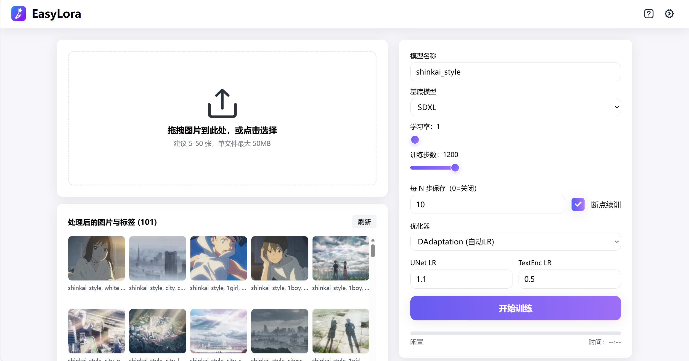
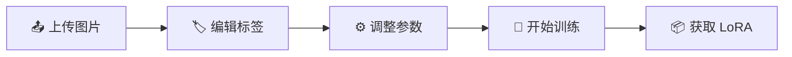

<div align="center">

# 🎨 EasyLora


**一键训练你的专属 LoRA 模型**

[](https://python.org)
[](https://fastapi.tiangolo.com)
[](https://reactjs.org)
[](https://typescriptlang.org)
[](https://tailwindcss.com)

[English](./README.en.md) | 简体中文



</div>

---

## ✨ 特性亮点

<table>
<tr>
<td width="50%">

### 🚀 开箱即用
- 无需复杂配置，一键启动
- 自动检测 GPU / VRAM
- 智能参数推荐

</td>
<td width="50%">

### 🎯 专注体验
- 拖拽上传图片
- 可视化标签编辑
- 实时训练进度

</td>
</tr>
<tr>
<td width="50%">

### 🔧 灵活可控
- 支持 SD1.5 / SD2.1 / SDXL
- 多种优化器可选
- 断点续训

</td>
<td width="50%">

### 📦 一键部署
- 训练完成自动复制到 WebUI
- 中间检查点保存
- 完整日志追踪

</td>
</tr>
</table>

---

## 🛠️ 技术栈

<div align="center">

| 层级 | 技术 |
|:---:|:---|
| **前端** | React 18 + TypeScript + Vite + Tailwind CSS |
| **后端** | FastAPI + WebSocket + Pydantic |
| **训练** | Kohya sd-scripts + PyTorch + CUDA |
| **工具** | bitsandbytes + accelerate + safetensors |

</div>

---

## 📁 项目结构

```
EasyLora/
├── 🐍 server.py              # FastAPI 后端服务
├── 📁 EasyLora/              # 训练核心模块
│   ├── train.py              # 训练逻辑
│   └── config.py             # 配置管理
├── 🌐 web/                   # React 前端
│   └── src/
│       ├── ui/               # UI 组件
│       ├── store.ts          # 状态管理
│       └── utils/            # 工具函数
├── 📂 workspace/             # 数据工作区
│   ├── raw_uploads/          # 原始上传
│   └── processed/dataset/    # 处理后数据
├── 📦 outputs/               # 训练产物
└── ⚙️ user_settings.json     # 用户配置
```

---

## 🚀 快速开始

### 环境要求

| 依赖 | 版本 | 说明 |
|:---:|:---:|:---|
| Python | 3.10+ | 建议使用虚拟环境 |
| Node.js | 18+ | 前端构建 |
| CUDA | 11.8+ | GPU 加速（可选） |
| VRAM | 6GB+ | 推荐 8GB 以上 |

### 1️⃣ 启动后端

```bash
# 创建虚拟环境
python -m venv .venv

# 激活环境 (Windows)
.\.venv\Scripts\activate

# 激活环境 (Linux/Mac)
source .venv/bin/activate

# 安装依赖
pip install -r requirements.txt

# 启动服务
python server.py
```

> 🌐 后端地址：`http://127.0.0.1:8000`

### 2️⃣ 启动前端

```bash
cd web
npm ci
npm run dev
```

> 🌐 前端地址：`http://127.0.0.1:5173`

---

## 📖 使用流程

<div align="center">



</div>

### Step 1: 上传图片 📤

- 拖拽图片到上传区域
- 支持批量上传
- 自动预览与缩略图

### Step 2: 编辑标签 🏷️

- 点击图片进入编辑器
- 使用预设标签快速添加
- 支持自定义标签

### Step 3: 调整参数 ⚙️

| 参数 | 建议值 | 说明 |
|:---|:---:|:---|
| 学习率 | 5 (中档) | 1-10 档位，自动映射 |
| 训练步数 | 1200 | 根据图片数量调整 |
| 优化器 | AdamW8bit | 低显存推荐 |
| 保存间隔 | 200 | 0 = 仅保存最终 |

### Step 4: 开始训练 🚀

- 点击「开始训练」按钮
- 实时查看日志与进度
- 支持中途停止

---

## 🎓 进阶技巧

### 🔬 使用 DAdaptation 自动探测最优学习率

<details>
<summary><b>点击展开详细步骤</b></summary>

#### 第一阶段：探测

1. 优化器选择 **`DAdaptation (自动LR)`**
2. 系统自动设置 UNet LR = 1.0, TextEnc LR = 0.5
3. 开始训练，观察日志中的 D 值
4. 等待数值稳定后记录，停止训练

#### 第二阶段：正式训练

1. 将记录的数值 **÷ 3**
2. 切换优化器为 **`Lion`** 或 **`AdamW8bit`**
3. 填入计算后的学习率
4. 开始正式训练

</details>

### ⚡ VRAM 优化建议

| VRAM | 推荐配置 |
|:---:|:---|
| 6GB | 优化器: AdamW8bit, Batch: 1 |
| 8GB | 优化器: AdamW8bit, Batch: 2 |
| 12GB+ | 优化器: Lion, Batch: 4 |

---

## 🔌 API 参考

<details>
<summary><b>主要接口</b></summary>

| 方法 | 端点 | 说明 |
|:---:|:---|:---|
| `GET` | `/api/settings` | 获取配置 |
| `POST` | `/api/settings` | 保存配置 |
| `POST` | `/api/upload` | 上传图片 |
| `POST` | `/api/update-caption` | 更新标签 |
| `GET` | `/api/processed-images` | 已处理图片列表 |
| `POST` | `/api/stop` | 停止训练 |
| `WS` | `/ws/train` | 训练进度推送 |

</details>

---

## ⚙️ 配置说明

<details>
<summary><b>常用配置项</b></summary>

```json
{
  "DEFAULT_OUTPUT_DIR": "./outputs",
  "DEFAULT_WORKSPACE_DIR": "./workspace",
  "DEFAULT_SD_WEBUI_LORA_DIR": "C:/path/to/webui/models/Lora",
  "COPY_TO_SD_WEBUI_ON_FINISH": true,
  "LR_SLIDER_MIN": 1e-5,
  "LR_SLIDER_MAX": 1e-4,
  "AUTO_ADD_MODEL_NAME_PREFIX": true
}
```

</details>

---

## 🧪 测试

```bash
# E2E 测试
cd web
npx playwright install
npm run test:e2e
```

---

## 📝 常见问题

<details>
<summary><b>Q: 首次启动很慢？</b></summary>

A: 需要下载模型权重，且首次会预处理数据到 `workspace/processed/`

</details>

<details>
<summary><b>Q: 训练时显存不足？</b></summary>

A: 尝试使用 AdamW8bit 优化器，减小 batch size，或降低图片分辨率

</details>

<details>
<summary><b>Q: 如何使用自定义基座模型？</b></summary>

A: 在设置页面配置 `DEFAULT_MODEL_SDXL` / `DEFAULT_MODEL_512` 等路径

</details>

---

## 📜 许可证

本项目采用 **PolyForm Noncommercial License 1.0.0**

- ✅ 非商业用途：免费使用、修改与再发布
- ❌ 商业用途：需取得作者书面授权

完整条款参见 [LICENSE](./LICENSE) 文件

---

<div align="center">

**Made with ❤️ for the AI Art Community**

⭐ 如果这个项目对你有帮助，请给一个 Star！

</div>
